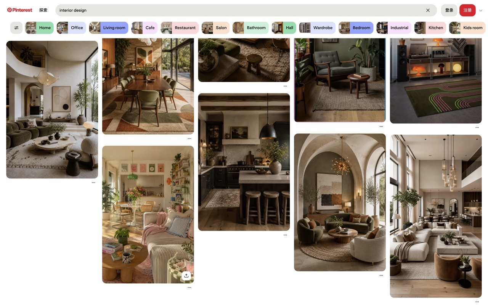

# Pinterest 大图布局

一个仅作用于 Pinterest 的 Chrome 扩展，可以把瀑布流固定为 2–6 列，让宽屏上的图片显示得更大。

## 效果预览



在扩展弹窗中选择自动布局或固定 2–6 列：


## 下载安装

1. 在 [Releases](https://github.com/reallysix/pinterest-settings/releases/latest) 下载最新的 ZIP 文件并解压。
2. 在 Chrome 地址栏打开 `chrome://extensions`。
3. 打开右上角“开发者模式”。
4. 点击“加载已解压的扩展程序”。
5. 选择刚才解压的扩展目录。
6. 打开或刷新 Pinterest，点击工具栏中的扩展图标选择列数。

也可以直接克隆本仓库，然后将项目根目录作为“已解压的扩展程序”加载。

## 功能

- 自动、2、3、4、5、6 列布局。
- 单独的启用开关。
- 设置通过 Chrome 同步存储保存。
- 自动响应无限滚动、图片加载、窗口变化和 Pinterest 站内跳转。

## 开发

扩展没有构建步骤和第三方运行时依赖。修改源码后，在 `chrome://extensions` 中点击扩展卡片上的刷新按钮即可。

运行测试：

```bash
npm test
```

## 隐私

扩展不收集、上传、出售或共享用户数据，详情见 [隐私说明](PRIVACY.md)。

本项目是独立的第三方工具，与 Pinterest 没有隶属或官方合作关系。
